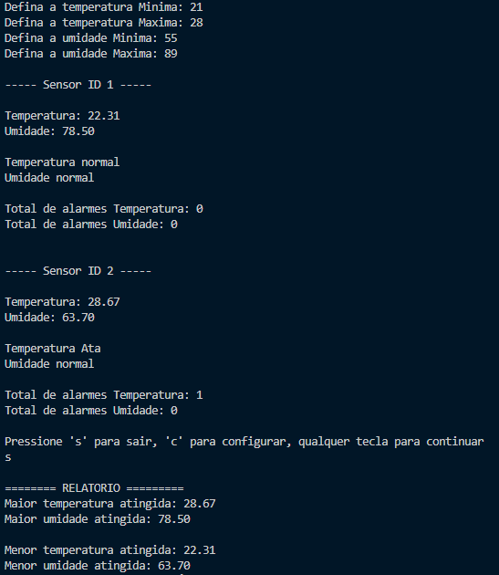

# **Projeto Final** :memo:  

Projeto desenvolvido para consolidar os conceitos aprendidos no curso [Curso C - Embarcados](https://cursos.embarcados.com.br/cursos/linguagem-c/).  

---

## :rocket: **Índice**  

- [Sobre](#sobre)  
- [Funcionalidades](#funcionalidades)  
- [Pré-requisitos](#pré-requisitos)  
- [Como Usar](#como-usar)

---

## 💡 **Sobre**  

Este projeto consiste em uma biblioteca em C projetada para receber e processar dados de sensores de temperatura e umidade. Os dados são exibidos em uma interface para que os usuários possam tomar decisões baseadas em leituras em tempo real.  

A biblioteca também inclui funcionalidades para alertas e relatórios, permitindo um uso eficiente e personalizado.  

---

## 🚀 **Funcionalidades**  

- **Visualização de Dados**: Apresenta os valores de temperatura e umidade em tempo real.  
- **Emissão de Alertas**: Notifica o usuário quando os valores ultrapassam os limites definidos.  
- **Configuração de Limites**: Permite ao usuário personalizar os limites de temperatura e umidade.  
- **Relatório de Dados**: Gera um relatório com os dados coletados para análise posterior.  

---

---
## :bar_chart: **Visualizção**

---

## 📋 **Pré-requisitos**  

Para executar este projeto, você precisará de um compilador C. Aqui estão algumas opções:  

### **Usando o Navegador**  
- Utilize o compilador online: [Online GDB - Compilador C](https://www.onlinegdb.com/).  

### **Ambiente Local**  
- **GCC (GNU Compiler Collection)**:  
  Certifique-se de que o GCC está instalado no seu sistema. Para instalar:  
  ```bash
  # No Ubuntu/Debian
  sudo apt update
  sudo apt install gcc

  # No Windows, use o MinGW (ou outro compilador C)
---

## 🛠️ **Como Usar**  

1. Clone este repositório no seu ambiente de trabalho:  
   ```bash
   git clone https://github.com/seu-usuario/projeto-final-c.git
   cd projeto-final-c
   ```  

2. Execute o programa:  
   ```bash
   ./programa
   ```  

4. Siga as instruções na interface para interagir com o programa.  

---
